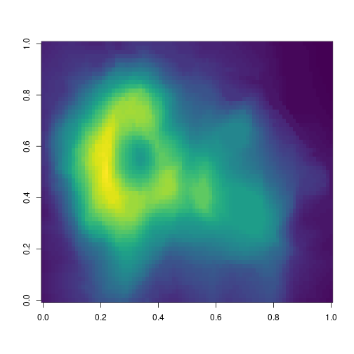
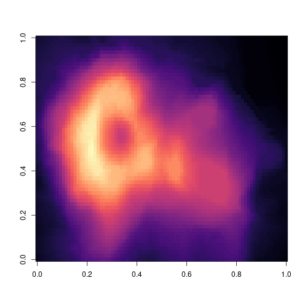

The code below demonstrates two color palettes in the [viridis](https://github.com/sjmgarnier/viridis) package. Each plot displays a contour map of the Maunga Whau volcano in Auckland, New Zealand. This document comes from https://rstudio.cloud/project/181952 and is used on https://rmarkdown.rstudio.com/lesson-9.html

## Viridis colors


```r
image(volcano, col = viridis(200))
```



## Magma colors


```r
image(volcano, col = viridis(200, option = "A"))
```


